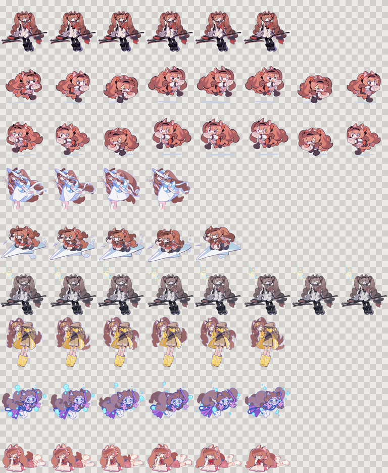

# codexpet-angelina

把安洁（Angelina）的透明动画素材整理成可直接用于 Codex 桌面端的原生自定义宠物。

这是一个 **Codex Pets 素材包**，不是独立桌面应用，不会启动后台服务，也不会接管或额外运行 Codex 任务。

<p align="center">
  
</p>

## 项目内容

- 可直接安装的 Codex Pets v1 宠物包。
- 由现有透明 GIF 自动生成的 8×9 精灵表。
- 统一角色缩放、底部锚点和每行动画帧数的可重复生成脚本。
- 保留原始 GIF、PNG 和 UI 素材，方便后续调整动作映射。

当前成品规格：

| 项目 | 数值 |
| --- | --- |
| 宠物名称 | 安洁 |
| 宠物目录 ID | `anjie` |
| Sprite 版本 | v1 |
| 精灵表尺寸 | 1536×1872 |
| 单格尺寸 | 192×208 |
| 格式 | 透明 WebP（RGBA） |

## 安装

### 1. 下载仓库

```powershell
git clone https://github.com/BingH225/codexpet-angelina.git
cd codexpet-angelina
```

也可以直接从 GitHub 下载 ZIP 并解压。

### 2. 复制宠物文件

在 PowerShell 中运行：

```powershell
$petDir = Join-Path $env:USERPROFILE ".codex\pets\anjie"
New-Item -ItemType Directory -Force -Path $petDir
Copy-Item -LiteralPath ".\codex-pet\anjie\pet.json" -Destination $petDir -Force
Copy-Item -LiteralPath ".\codex-pet\anjie\spritesheet.webp" -Destination $petDir -Force
```

### 3. 在 Codex 中启用

1. 打开 Codex 桌面端的 **Settings → Pets**。
2. 点击 **Refresh**。
3. 选择“安洁”。
4. 输入 `/pet`，或从命令菜单选择 **Wake Pet**。

自定义宠物的启用方式可参考 [OpenAI Pets 文档](https://learn.chatgpt.com/docs/pets)。

## 动作映射

Codex v1 使用九行固定动作。当前素材映射如下：

| Codex 动作行 | 帧数 | 使用素材 | 触发含义 |
| --- | ---: | --- | --- |
| `idle` | 6 | 坐坐 | 无活动时的默认循环 |
| `running-right` | 8 | 送货（镜像） | 宠物向右移动 |
| `running-left` | 8 | 送货 | 宠物向左移动 |
| `waving` | 4 | 海边 | 就绪或招呼反馈 |
| `jumping` | 5 | 纸飞机 | 悬停互动 |
| `failed` | 8 | 坐坐＋冷色/抖动/星花 | 任务失败或系统错误 |
| `waiting` | 6 | 探险 | 等待审批、回答或决定 |
| `running` | 6 | 潜水 | Codex 正在工作 |
| `review` | 6 | 看书 | 检查与阅读工作 |

`购物.gif`、`拍照.gif` 和 `骑行.gif` 暂未进入 v1 精灵表，但作为后续替换或扩展素材保留。失败状态额外使用 `安洁/UI素材/22.png`。

## 目录结构

```text
codexpet-angelina/
├─ codex-pet/anjie/
│  ├─ pet.json              # Codex 宠物清单
│  ├─ spritesheet.webp      # 可直接安装的透明精灵表
│  └─ preview.png           # 九行动作预览
├─ scripts/
│  └─ build_codex_pet.py    # 确定性生成与校验脚本
└─ 安洁/
   ├─ GIF/                  # 原始动画素材
   ├─ PNG/                  # 原始静态素材
   └─ UI素材/               # 原始 UI 素材
```

## 重新生成

需要 Python 3 和 [Pillow](https://pillow.readthedocs.io/)：

```powershell
python -m pip install Pillow
python scripts/build_codex_pet.py
```

脚本会：

- 从每个 GIF 均匀选取所需帧；
- 按整行动画的联合透明边界裁切；
- 统一缩放并固定底部锚点，减少状态切换时的位置跳动；
- 生成透明 `spritesheet.webp` 和棋盘格 `preview.png`；
- 验证尺寸、必需格非空以及文件不超过 20 MiB。

重新生成后，将 `codex-pet/anjie/pet.json` 和 `spritesheet.webp` 再次复制到 Codex Pets 目录并刷新即可。

## 关于 v2

当前发布的是兼容现有素材的 v1 成品。Codex Pets v2 在原有九行动作之外增加两行、共 16 个注视方向，精灵表尺寸为 1536×2288。升级 v2 需要补充安洁眼睛、头部与上半身的方向差分；当前仓库没有用简单旋转或机械变形伪造这些差分。

## 素材与使用声明

安洁角色及相关美术、动画和 UI 素材的权利归原权利人所有。素材由使用者提供并标注为鹰角网络官方分享内容，本仓库仅用于非官方、非商用的个人体验与技术研究。

仓库中的生成脚本及整理工作不改变原始素材的权利归属，也不向使用者授予角色或美术素材的再分发、商用或再授权权利。公开传播或二次使用前，请自行核对原始素材的授权范围。

本项目与 OpenAI、鹰角网络均无隶属、合作或官方背书关系。
